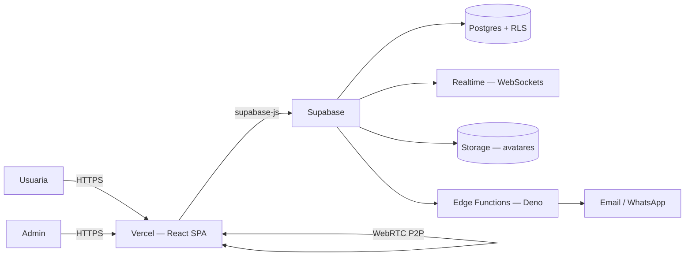

# Mujer-ES

Plataforma integral para la comunidad **Mujer-ES**: cursos, chats, videollamadas y gestión comunitaria en un **entorno cerrado** — solo se puede ingresar con una cuenta creada por un administrador.

    

---

##  Características

### Diseño minimalista
- Landing con animación de bienvenida (Lottie), texto animado tipo *BlurText* y **carrusel de imágenes** optimizado para móvil (webp ≤ 900 px, compresión early via Sharp).
- Estética sobria: tipografía **Playfair Display**, acento violeta `#581C87` sobre fondo alabastro.
- **Perfil personalizable**: foto de perfil con **modal de recorte 1:1** (arrastre + zoom, respeta orientación EXIF, exporta 512×512 webp), biografía y hobbies.

### Entorno cerrado
- Sin auto-registro: los usuarios se crean por un **administrador** (edge function `admin-create-user`) o directamente sobre la base de Supabase Auth.
- Autenticación por email + contraseña, recuperación por **código enviado por email/WhatsApp**, recaptcha (Turnstile) y bloqueo temporal de usuarios.
- Backend protegido con **Row Level Security (RLS)** y edge functions en **Deno** para las operaciones sensibles del panel de administración.

### Comunicación en tiempo real
- Chat general y **mensajes directos** con **WebSockets** (Supabase Realtime): los mensajes llegan al instante, con indicador de no leídos por conversación.
- **WebRTC (P2P)**: videollamadas y audio entre usuarias, con *signaling* a través de RPC en tiempo real (`send_call_signal`), y configuración de **servidor TURN** opcional para atravesar NAT/firewalls.
- Reportes de mensajes con **auto-bloqueo** tras umbral de reportes (`dm-reports-autoblock`).

### Cursos
- **Cursos en vivo** con horarios, ubicación (presencial) y **vacantes**.
- Inscripción con límite de cupo, registro de **asistencia**, estado *concluido* y eventos con imágenes.
- Panel admin con grilla adaptable (4/2/1 columnas), cobertura de eventos y edición completa de cursos.

### Asistencia con QR
- **Presencial**: las alumnas presentan un **código QR** que el admin escanea con la cámara (`html5-qrcode`) para marcar llegada.
- **Videollamada**: la asistencia se registra ingresando un **código numérico** generado por la sesión.

### Panel de administración
- Gestión completa de usuarios: detalles, teléfono, contraseña, **bloqueos** con vencimiento, y **borrado con cascada** en mensajes (FK `ON DELETE CASCADE`).
- Protección de la cuenta principal (`wafflenub12`): la edge function `admin-delete-user` la rechaza.
- Sincronización automática de perfiles (usuarios y admins comparten la misma vista de perfil).

---

## Stack tecnológico

| Capa | Tecnología |
|---|---|
| Frontend | React 19, TypeScript, Vite 8 (Rolldown), Tailwind CSS 4 |
| Animaciones | Motion (Framer), Lottie (Web) |
| UI helper | `sileo` (toasts), `react-easy-crop` (recorte de avatar) |
| QR / asistencia | `html5-qrcode` (escaneo), `qrcode` (generación) |
| Backend | Supabase: Postgres, Auth, Realtime (WebSockets), Storage, Edge Functions (Deno) |
| Realtime multimedia | WebRTC P2P con signaling vía Supabase Realtime + TURN opcional |
| Emails | Edge functions con SMTP (`send-email-hook`, `send-recovery-code`) |
| Deploy | Vercel (frontend), Supabase (base + edge functions) |
| Testing | Vitest + jsdom (incluye suite de WebRTC) |

---

## Arquitectura



- **Frontend** (carpeta `src/`): componentes por área — `home/` (landing, perfil, chats), `admin/` (panel), `ui/` (modal de recorte, QR, modales), `lib/` (Supabase client, WebRTC, consultas).
- **Backend** (carpeta `supabase/`): `schema.sql` (esquema completo), `migrations/` (historial), `functions/` (edge functions) y `fix-rls-recursion.sql` (políticas RLS).
- **Entorno cerrado**: no existe flujo de registro público; las cuentas las crea el panel admin (o seed en base).

---

## Desarrollo local

```bash
npm install

# Variables de entorno (Copiar .env.example)
VITE_SUPABASE_URL=https://TU-PROYECTO.supabase.co
VITE_SUPABASE_ANON_KEY=TU_ANON_KEY
VITE_TURN_URLS=        # opcional, servidor TURN (stun/turn)
VITE_TURN_USERNAME=
VITE_TURN_CREDENTIAL=

npm run dev
```

> Para las edge functions hace falta la CLI de Supabase (`supabase functions deploy <fn> --project-ref <ref>`).

### Scripts

| Comando | Descripción |
|---|---|
| `npm run dev` | Servidor de desarrollo con HMR |
| `npm run build` | Type-check + build de producción (Rolldown) |
| `npm run lint` | ESLint |
| `npm test` / `npm run test:watch` | Vitest (incluye suite WebRTC con jsdom) |

---

## Notas técnicas

- **Recorte de avatar**: `croppedAreaPixels` de `react-easy-crop` se aplican **directamente sobre la imagen original** (el paquete los entrega en coordenadas naturales), garantizando que el encuadre coincida 1:1 con lo seleccionado.
- **Caché de avatares**: la URL pública del avatar incluye un parámetro `?v=<timestamp>` para invalidar cachés de navegador/CDN tras cada subida (upsert sobre el mismo path).
- **Borrado de usuarios**: `messages.sender_id` usa `ON DELETE CASCADE` y `conversations.assigned_admin_id` `SET NULL` para no bloquear la eliminación.
- Los avatares se sirven desde el bucket público `avatars` de Supabase Storage y se sincronizan entre `profiles` y `admins`.
